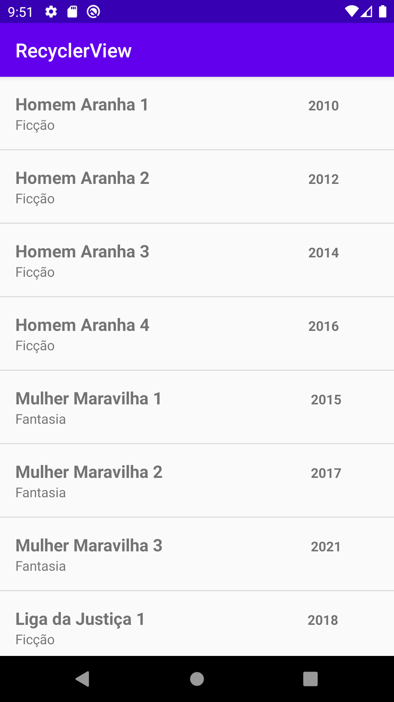

## An Android App example of how to create a RecylerView in Java
* Android Recycler View

### Reference
* https://developer.android.com/guide/topics/ui/layout/recyclerview?gclid=CjwKCAjwu5CDBhB9EiwA0w6sLe-hzfU_SaAGCgPoMFikGLFJFJdMTzbtDk5LPt5hM6i5i4FRSXDMrBoCMbAQAvD_BwE&gclsrc=aw.ds
* Udemy - Desenvolvimento Android Completo 2021 - aula 97 - 101
